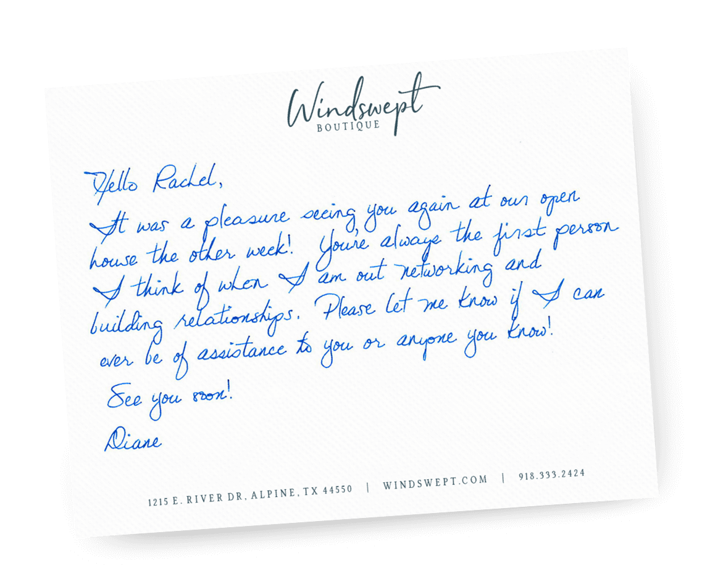

# Ghost Traveller

You answer 5 short questions. A few seconds later, a postcard arrives — written by the version of you who took the other road.

The concept: your **Ghost** is a parallel self who made a different choice at a key moment. They kept going where you stopped, stayed where you left. This app generates a handwritten postcard from them, addressed to you, referencing the exact fork in the road you describe.

**[→ Try it live](https://ghost-traveller.vercel.app)**

---

## What it looks like


*The output is a printable B&W postcard: postmark, signal field, city coordinates, and a short handwritten message.*

---

## How it works

1. **Where is your Ghost?** — city + a specific place they keep returning to
2. **Who are they?** — interests, a feeling they never let go of
3. **What do you need to hear?** — one honest thing
4. **Your name** — for the address
5. **The fork** — the choice they made that you didn't

GPT-4o writes the message. It's short (3 lines max), grounded in the details you gave, and sounds like it was written by someone who knows you from the inside.

The postcard is rendered on a canvas — printable as PNG.

---

## Handwriting

The app uses **Cursive Ink** by default: a fine-pen cursive renderer built on [Dancing Script](https://fonts.google.com/specimen/Dancing+Script), drawn word-by-word on canvas with micro ink jitter and an ink-bleed shadow.



No model, no server — runs entirely in the browser.

---

## Stack

- **Next.js 15** (App Router) + **TypeScript**
- **OpenAI GPT-4o** — message generation + optional OCR of uploaded handwriting
- **Canvas 2D** — postcard rendering + cursive ink
- **Google Fonts** — Dancing Script, Cormorant Garamond
- No database, no auth

---

## Local setup

```bash
git clone https://github.com/Polpii/Ghost_Traveller.git
cd Ghost_Traveller
npm install
```

Create `.env.local`:

```
OPENAI_API_KEY=sk-...
```

```bash
npm run dev
```

Open [http://localhost:3000](http://localhost:3000).

---

## Deploy

Push to GitHub, import on [Vercel](https://vercel.com/new). Add `OPENAI_API_KEY` as an environment variable. That's it.

The Python handwriting service (HWT / DiffusionPen) is optional — if it's not running, those engine options are automatically hidden and Cursive Ink is used instead.


## Deploy on Vercel

The easiest way to deploy your Next.js app is to use the [Vercel Platform](https://vercel.com/new?utm_medium=default-template&filter=next.js&utm_source=create-next-app&utm_campaign=create-next-app-readme) from the creators of Next.js.

Check out our [Next.js deployment documentation](https://nextjs.org/docs/app/building-your-application/deploying) for more details.
